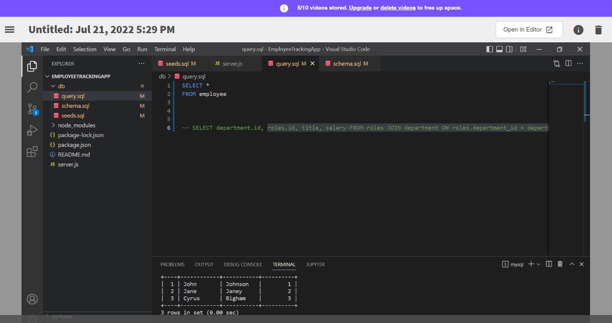

# EmployeeTrackingApp

# dependencies required
MYSQL2 
Inquirer

# USAGE 

to review tables log into mysql from the terminal. Once logged in terminal command SOURCE db/schema.sql. then SHOW TABLES and you can review tables from the seeds.sql.

# Video
https://drive.google.com/file/d/1wBcZWETr2E2hEQsqKRoOuoDHBfZ7Jo_X/view

